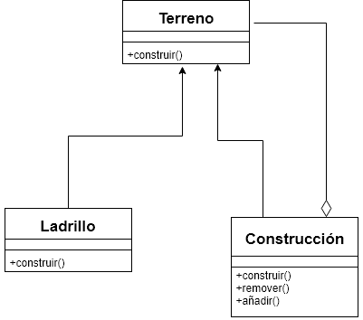

# Composite-ST0250-2018-2
Composite es un patrón que promueve el desarrollo de código por agrupamiento de componentes simples.

Juan Camilo Echeverri
Santiago Tello

# Explicación

las casas no están hechas de una pieza, si observamos las paredes están echas de pequeñas piezas “ladrillos”, entonces, el conjunto de estos ladrillos crea paredes, y un conjunto de paredes crean una casa. Por ende, es necesario usar el patrón de diseño Composite ya que básicamente lo que me propone es construir estructuras complejas partiendo de estructuras mas simpes y mas pequeñas 

## Diagrama de Clases 


```java
public interface Terreno {
	public void construir();
}
```


```java
public class Ladrillo implements Terreno {

	public void construir(){
		System.out.println("Colocando ladrillo");
	}
}

```


```java
public class Construccion implements Terreno {

	private ArrayList<Terreno> materiales = new ArrayList<Terreno>();

	@Override
	public void construir(){
        Terreno.construir();
	}

	public void anadir(Terreno material){
		materiales.add(material)

	}

	public void remover(Terreno material){
		materiales.remove(material);
	}
}

```


```java
public class Terrenos {

   public static void main(String[] args) {

   	  Terreno ladrillo1 = new Ladrillo();
   	  Terreno ladrillo2 = new Ladrillo();
   	  Terreno ladrillo3 = new Ladrillo();
   	  Terreno ladrillo4 = new Ladrillo();

   	  Construccion construccion = new Construccion();
   	  construccion.anadir(ladrillo1);
   	  construccion.anadir(ladrillo2);
   	  construccion.anadir(ladrillo3);
   	  construccion.anadir(ladrillo4);

   	  construccion.construir();
   	
   }

}
```
## Descripcion del codigo
El código la verdad es muy sencillo y mas aun muy sencillo de entender, el Terreno es una interfaz que solo tiene una operación y es la de construir. Terreno es extendido por las otras clases que son “Ladrillo” y “Construcción”.
Ladrillo es la parte mas simple de la estructura es lo que conlleva a las pequeñas piezas que conforman la estructura, este tiene una operación y es la de “colocar un ladrillo” básicamente ir construyendo o en el caso del programa “construir”, este hereda de Terreno.
Construcción, tiene métodos de añadir, remover y construir, esto nos permite agregar o remover objetos de tipo “Terreno” y como “Terreno” es una interfaz lo que podemos agregar es objetos de tipo “Construccion” y tipo “ladrillo”.

## Webgrafia

https://www.oscarblancarteblog.com/2014/10/07/patron-de-diseno-composite/
